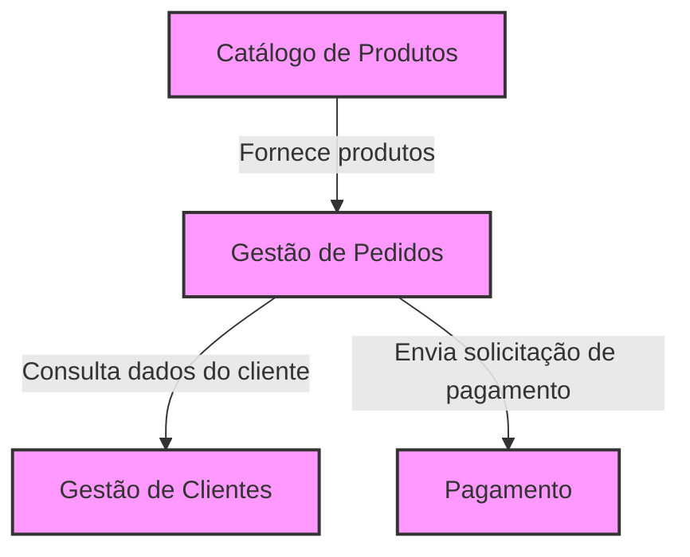

# Como Aplicar Domain-Driven Design (DDD): Um Guia Prático

O **Domain-Driven Design (DDD)** é uma abordagem de desenvolvimento de software que prioriza o domínio do negócio, ajudando a criar sistemas alinhados com as necessidades reais da empresa. Este guia oferece um passo-a-passo para aplicar o DDD, desde a compreensão do domínio até a implementação técnica, com exemplos práticos baseados em um sistema de streaming tipo Netflix.

---

## Tabela de Conteúdos
- [Como Aplicar Domain-Driven Design (DDD): Um Guia Prático](#como-aplicar-domain-driven-design-ddd-um-guia-prático)
  - [Tabela de Conteúdos](#tabela-de-conteúdos)
  - [O que é DDD?](#o-que-é-ddd)
  - [Entendendo o Domínio](#entendendo-o-domínio)
  - [Definindo a Linguagem Ubíqua](#definindo-a-linguagem-ubíqua)
  - [Delimitando Contextos](#delimitando-contextos)
  - [Criando Mapas de Contexto](#criando-mapas-de-contexto)
  - [Modelagem Estratégica](#modelagem-estratégica)
  - [Modelagem Tática](#modelagem-tática)
  - [Implementando o DDD](#implementando-o-ddd)
  - [Conclusão](#conclusão)

---

## O que é DDD?

O DDD é um conjunto de princípios que foca no **domínio** (o núcleo do negócio), na exploração criativa de modelos e no uso de uma **linguagem ubíqua** dentro de **contextos delimitados**. Ele é ideal para sistemas complexos, ajudando a evitar confusão e alinhar o software ao negócio.

- **Por que usar?** Reduz problemas de comunicação e organiza o sistema em torno do que realmente importa: o domínio.
- **Exemplo:** Em um sistema de streaming, o DDD garante que "vídeo" e "catálogo" sejam bem modelados como o coração do negócio.

---

## Entendendo o Domínio

O **domínio** é o conjunto de ideias, conhecimentos e processos que definem o negócio. É a razão de ser do software.

- **Como identificar?** Converse com especialistas do domínio (domain experts) para entender o "core business".
- **Exemplo:** Em uma mini Netflix, o domínio principal é gerenciar vídeos e catálogos, enquanto pagamentos são secundários.

**Passo prático:** Reúna-se com stakeholders para mapear o que torna o negócio único.

---

## Definindo a Linguagem Ubíqua

A **linguagem ubíqua** é um vocabulário compartilhado entre desenvolvedores e especialistas, refletido no código e na comunicação.

- **Por que é importante?** Evita ambiguidades (ex.: "cliente" pode ter significados diferentes em vendas e marketing).
- **Como criar?**
  1. Identifique termos-chave com domain experts.
  2. Crie um glossário documentado (ex.: Google Docs, Wiki).
  3. Use esses termos no código e nas discussões.

**Exemplo de Glossário (Mini Netflix):**
- **Playback**: Processo de executar um vídeo.
- **Vídeo**: Conteúdo assistido pelo usuário.
- **Minha Lista**: Lista de vídeos que o usuário quer ver depois.
- **Catálogo**: Coleção de vídeos disponíveis.

---

## Delimitando Contextos

Os **bounded contexts** (contextos delimitados) dividem o sistema em partes com responsabilidades claras, cada uma com seu próprio modelo e linguagem ubíqua.

- **Benefício:** Reduz a complexidade em sistemas grandes.
- **Como identificar?** Observe áreas do negócio com regras ou terminologias distintas.
- **Exemplo:** 
  - Contexto "Catálogo": Gerencia busca e exibição de vídeos.
  - Contexto "Playback": Controla a execução de vídeos.

**Passo prático:** Use histórias de usuário (ex.: "O usuário navega no catálogo e faz playback") para encontrar limites naturais.

---

## Criando Mapas de Contexto

Os **context maps** mostram as relações entre bounded contexts, como dependências e fluxos de comunicação.

- **Tipos de relação:**
  - **Upstream/Downstream:** Quem manda (upstream) e quem se adapta (downstream).
  - **Cliente/Fornecedor:** Um contexto fornece dados para outro.
  - **Núcleo Compartilhado:** Contextos que compartilham lógica ou modelos.
- **Exemplo:** "Catálogo" (upstream) fornece dados para "Perfil" (downstream), que se adapta às mudanças no catálogo.

**Passo prático:** Desenhe um diagrama com setas indicando as relações entre contextos.

---

## Modelagem Estratégica

A modelagem estratégica classifica os domínios e estrutura o sistema em torno deles.

- **Tipos de domínios:**
  - **Core Domain:** Foco principal (ex.: "Vídeo" e "Catálogo").
  - **Generic Domain:** Reutilizável (ex.: "Pagamento", "Autenticação").
  - **Supporting Domain:** Suporta o core (ex.: "Perfil").
- **Como aplicar?** Priorize o core domain e modele os outros em torno dele.

**Exemplo:** Na mini Netflix, "Vídeo" é o core, enquanto "Pagamento" é genérico.

---

## Modelagem Tática

A modelagem tática define os componentes dentro de cada bounded context.

- **Entidades:** Objetos com identidade única.
  - Exemplo: "Pagamento" com ID e propriedades como valor.
- **Agregados:** Grupos de entidades com um aggregate root.
  - Exemplo: "Pagamento" (root) com "Transação".
- **Value Objects:** Objetos imutáveis para conceitos descritivos.
  - Exemplo: "Cartão de Crédito" com número e validade.
- **Repositórios:** Gerenciam acesso a dados por agregados.
  - Exemplo: "PagamentoRepository" para salvar e consultar pagamentos.
- **Serviços:** Coordenam lógica de negócio.
  - Exemplo: "PagamentoService" para processar pagamento e enviar e-mail.

**Passo prático:** Modele cada contexto com esses elementos, mantendo a linguagem ubíqua.

---

## Implementando o DDD

Siga estes passos para aplicar o DDD no seu projeto:

1. **Entenda o Domínio**
   - Converse com domain experts para mapear o core business.
2. **Extraia a Linguagem Ubíqua**
   - Crie um glossário e use-o consistentemente.
3. **Defina Bounded Contexts**
   - Divida o sistema em partes com limites claros.
4. **Crie um Context Map**
   - Mapeie as relações entre contextos.
5. **Modele Estrategicamente**
   - Identifique core, generic e supporting domains.
6. **Modele Taticamente**
   - Use entidades, agregados, value objects, repositórios e serviços.
7. **Estruture o Código**
   - Organize por contextos, com camadas (ex.: domínio, aplicação, infraestrutura).
   - Exemplo: "Catálogo" com NoSQL, "Pagamento" com banco relacional.
8. **Itere**
   - Refine o modelo com feedback contínuo.

---

## Conclusão

O DDD é mais do que camadas técnicas — é uma filosofia que alinha o software ao negócio. Comece pelo domínio, use a linguagem ubíqua para unir equipes e estruture o sistema com contextos claros. Com prática, você construirá aplicações mais robustas e fáceis de manter.

---